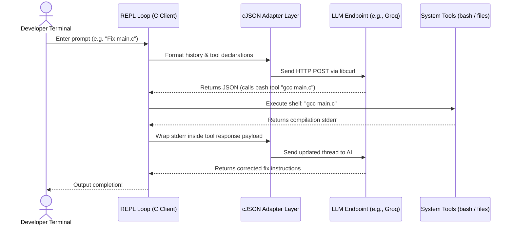

Terminal-based coding assistants are highly useful, but standard solutions are often tied to specific AI providers or runtimes. To explore low-level systems programming and AI interfaces, I built **Claude Code C**—an advanced, terminal-based AI coding assistant written in C using the modern C23 standard.

This project implements a complete multi-turn agent loop, an interactive REPL with command routing, and a multi-provider translation layer that makes it completely AI provider-agnostic.

> [!note] Architecture Goal
> Interface with multiple cloud LLMs (OpenAI, Anthropic, Gemini, Groq, OpenRouter) and local models (Ollama) through a single C-based binary, using raw HTTP requests and stream formatting.

---

## 1. Modern C23 Standard Features

Writing this program in modern C allowed me to leverage C23 additions to write cleaner, safer code:
- **`nullptr`**: Replaced standard `NULL` macros with the type-safe native pointer literal `nullptr` to avoid pointer comparison warnings.
- **`bool`, `true`, `false`**: Used native keywords directly without importing `<stdbool.h>`.
- **`typeof`**: Used for type-generic macro definitions.
- **Attributes (`[[nodiscard]]`, `[[deprecated]]`)**: Applied compiler warnings to ensure proper check results in file systems and HTTP operations.

---

## 2. In-Memory Schema Adapter

Different AI providers expect completely different payload structures. For example, Anthropic uses the Messages API layout with distinct `content` blocks for tools, while OpenAI expects standard Chat Completions JSON formats with `tool_calls` attributes.

To solve this, I wrote an in-memory translation layer in C using `cJSON`:
1. **Unified Payload Format**: The inner REPL engine stores a single representation of the conversation state.
2. **Anthropic Adapter**: If the user selects Anthropic's Claude, the client intercepts the request, maps tool-call responses into blocks containing standard content types, and serializes the result.
3. **OpenRouter & OpenAI translation**: Maps internal states to standard formats, letting local engines like Ollama speak seamlessly with the same agent loop.

```c
// Example schema conversion trace:
// Internal representation -> Adapter parser -> Anthropic message payload
cJSON *content_array = cJSON_CreateArray();
cJSON *text_block = cJSON_CreateObject();
cJSON_AddStringToObject(text_block, "type", "text");
cJSON_AddStringToObject(text_block, "text", user_prompt);
cJSON_AddItemToArray(content_array, text_block);
```

---

## 3. The Tool Calling Agent Loop

The agent operates in a continuous feedback loop:

1. **User input is received**: The prompt is processed and sent to the LLM along with the list of tools.
2. **LLM determines tool calls**: The LLM returns a JSON payload detailing which tool to call and with what parameters.
3. **Local Tool Execution**: The client parses the JSON, executes the tool on the local system (e.g. read a file, execute a shell command), and gathers the output.
4. **Correction Feedback**: If a tool fails or throws an error (such as a compilation error during bash execution), the error is fed back to the LLM in the next turn so it can self-correct.



---

## 4. Pre-configured Tools

Claude Code C exposes a set of 7 safety-bounded tools to the model:

| Tool Name | Action | Implementation Detail |
| :--- | :--- | :--- |
| `Read` | File inspection | Opened with standard file pointers and read with size limits. |
| `Write` | File creation/edit | Handles sub-path validation and creates folders recursively. |
| `Bash` | Command execution | Spawns a child process using `fork` and standard Unix pipes. |
| `ListDirectory` | Folder listing | Uses Unix `dirent.h` interface to inspect file structures. |

---

## 5. Why C instead of Node/Python?

Building a terminal coding agent in C offers major advantages:
1. **Blazing Fast Startup**: Instant compilation and loading without Node startup latency or virtual environments.
2. **Minimal Executable Size**: Compiles to a single tiny native binary under `200KB` with no external dependencies other than `libcurl` and `cJSON`.
3. **Deep OS Integration**: Direct interaction with Linux system calls, fork mechanics, and standard file handles, ensuring secure and precise execution.
