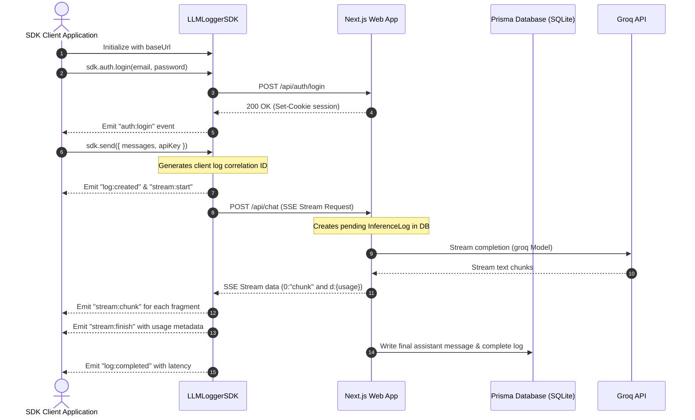

Tracking and monitoring LLM metrics such as input/output token counts, execution latency, and error states is crucial when operating production AI agents. To build a robust utility for this, I developed **LLM Logger**—a self-hosted platform designed to capture, log, monitor, and analyze LLM inference activity in real-time.

The system features an event-driven TypeScript SDK, a Next.js 16 dashboard UI, and a SQLite/Prisma backend database.

> [!note] Ingestion Strategy
> Build an event-driven framework where developers initialize a client SDK that tracks request lifecycles (authentication, stream chunks, token metrics, network telemetry) and sends logs asynchronously without blocking execution.

---

## 1. Event-Driven TypeScript SDK

The client SDK behaves like a dispatcher. When a developer triggers a chat request, the SDK emits typed events that the client application can bind listeners to:

- `auth:login` / `auth:logout`: Authentication states.
- `log:created` / `log:completed`: Tracks request ingestion and completion latency.
- `stream:start` / `stream:chunk` / `stream:finish`: Captures Server-Sent Events (SSE) completion streams and aggregates token counts.

This makes integrating streaming chat clients into UI components simple and clean, while telemetry data compiles automatically in the background.

```typescript
// Sample Event Listener integration
const sdk = new LLMLoggerSDK({ baseUrl: "/api" });

sdk.on("stream:chunk", (chunk) => {
  appendMessageChunk(chunk.text);
});

sdk.on("log:completed", (telemetry) => {
  console.log(`Latency: ${telemetry.latency}ms, Tokens: ${telemetry.tokens}`);
});
```

---

## 2. Ingestion sequence

To ensure that latency and streams are recorded correctly, the SDK coordinates requests using a unique correlation ID:



---

## 3. Real-Time Analytics Dashboard

The Next.js 16 web application serves a clean dashboard containing charts and tables:
- **Metrics Grid**: Displays total requests, prompt tokens, completion tokens, average latency, and API success rate.
- **Latency Charts**: Visualizes network round-trip time vs token generation speed, helping locate performance bottlenecks.
- **Completion History**: Lists active prompts, completions, logs, and errors in a filterable table.

The UI is built with Tailwind CSS, utilizing glassmorphic layouts and neon colors for readability.

---

## 4. Operational Guardrails

To prevent system overload and secure user data, the platform implements two main filters:
1. **PII Redaction**: Inputs and outputs are run through a local sanitization filter that filters out credit cards, API keys, and email addresses before writing logs to SQLite, protecting sensitive user data.
2. **Rate Limiting**: Integrates Redis rate limits (via Upstash) to enforce quotas (e.g. 50 chat requests per 2 hours per user) to mitigate botting and API abuse.
